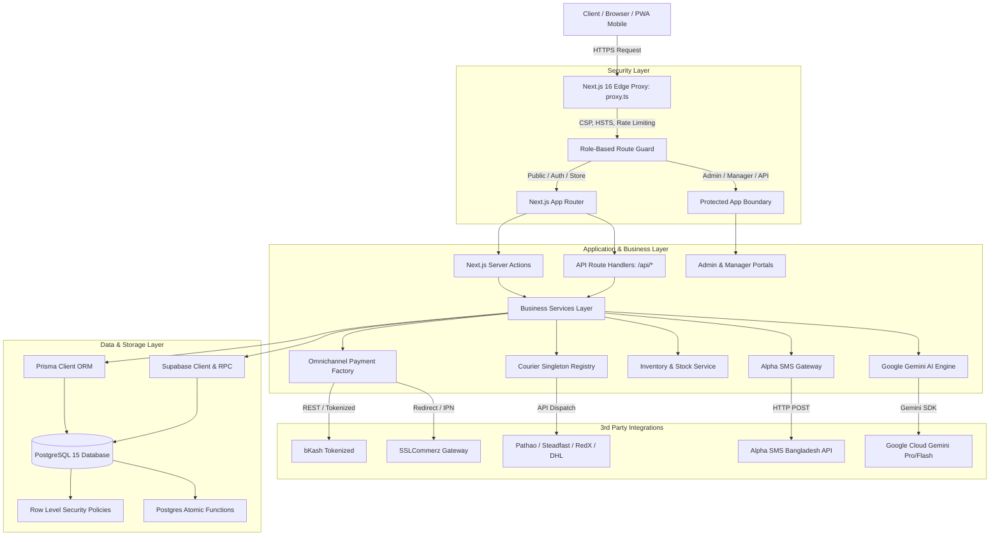
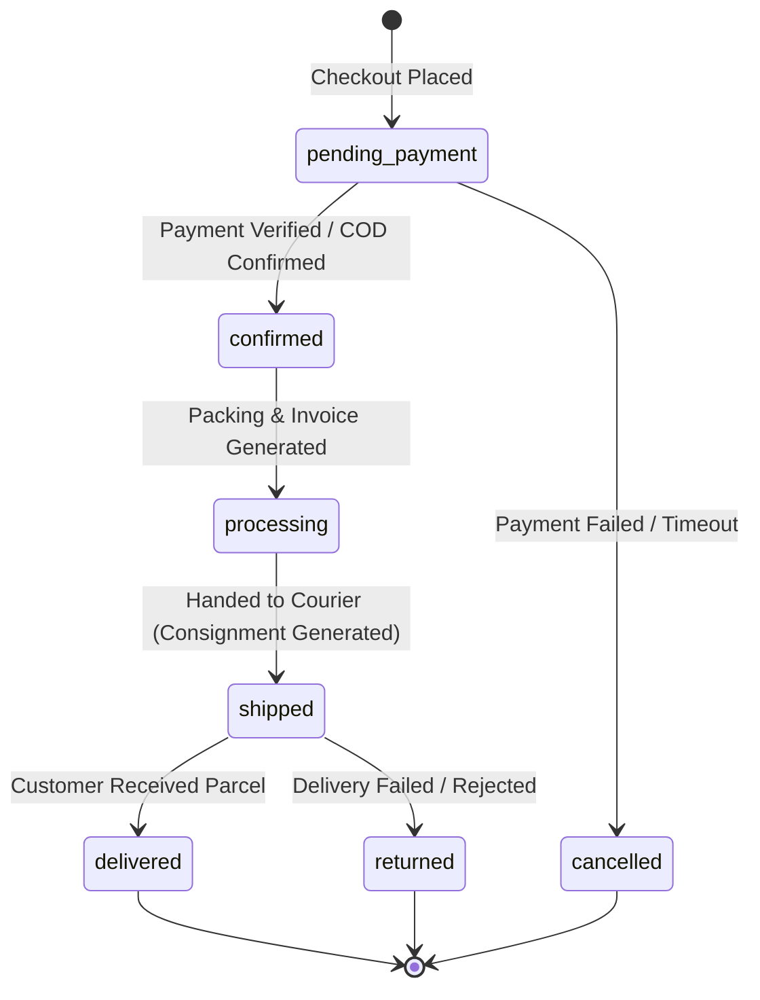
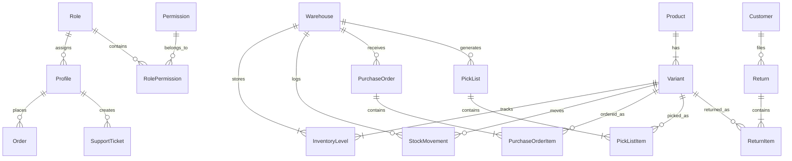

# ⚓ Anchor Fashion (অ্যাঙ্কর ফ্যাশন) — Enterprise E-Commerce & Omnichannel ERP Platform

[](https://nextjs.org/)
[](https://react.dev/)
[](https://www.typescriptlang.org/)
[](https://supabase.com/)
[](https://www.prisma.io/)
[](https://tailwindcss.com/)
[](https://vitest.dev/)
[](https://serwist.pages.dev/)

> **Anchor Fashion** হলো একটি আধুনিক, এন্টারপ্রাইজ-গ্রেড, স্কেলেবল এবং পূর্ণাঙ্গ ওমনিচ্যানেল ই-কমার্স এবং ওয়্যারহাউস ইআরপি (ERP) প্ল্যাটফর্ম। এটি বিশেষত বাংলাদেশী শীর্ষ ফ্যাশন ব্র্যান্ড ও গ্লোবাল রিটেইল চেইনের জটিল অপারেশনাল চাহিদা পূরণের উদ্দেশ্যে **Next.js 16 (App Router + Turbopack)**, **Supabase PostgreSQL**, **Prisma ORM**, **bKash Tokenized**, **SSLCommerz**, **Alpha SMS BD**, **১০টি স্থানীয় ও আন্তর্জাতিক কুরিয়ার গেটওয়ে** এবং **Google Gemini AI** ইঞ্জিন সমন্বয়ে তৈরি করা হয়েছে।

---

## 📌 সূচিপত্র (Table of Contents)

1. [প্রকল্প পরিচিতি ও এক্সেিকিউটিভ সামারি (Project Overview)](#-প্রকল্প-পরিচিতি-ও-এক্সেিকিউটিভ-সামারি-project-overview)
2. [সিস্টেম আর্কিটেকচার ও ডেটাফ্লো (System Architecture & Dataflow)](#-সিস্টেম-আর্কিটেকচার-ও-ডেটাফ্লো-system-architecture--dataflow)
3. [টেক স্ট্যাক ও ইকোসিস্টেম (Technology Stack & Ecosystem)](#-টেক-স্ট্যাক-ও-ইকোসিস্টেম-technology-stack--ecosystem)
4. [মডিউল-ভিত্তিক পূর্ণাঙ্গ বিশ্লেষণ (Comprehensive Feature & Module Analysis)](#-মডিউল-ভিত্তিক-পূর্ণাঙ্গ-বিশ্লেষণ-comprehensive-feature--module-analysis)
   - [১. কাস্টমার স্টোরফ্রন্ট ও শপিং অভিজ্ঞতা (Customer Storefront)](#১-কাস্টমার-স্টোরফ্রন্ট-ও-শপিং-অভিজ্ঞতা-customer-storefront)
   - [২. ওমনিচ্যানেল পেমেন্ট গেটওয়ে হাব (Omnichannel Payment Hub)](#২-ওমনিচ্যানেল-পেমেন্ট-গেটওয়ে-হাব-omnichannel-payment-hub)
   - [৩. মাল্টি-কুরিয়ার ও ৩পিএল লজিস্টিকস ইঞ্জিন (Courier & 3PL Logistics)](#৩-মাল্টি-কুরিয়ার-ও-৩পিএল-লজিস্টিকস-ইঞ্জিন-courier--3pl-logistics)
   - [৪. অর্ডার ম্যানেজমেন্ট সিস্টেম ও ওয়ার্কফ্লো (OMS Engine)](#৪-অর্ডার-ম্যানেজমেন্ট-সিস্টেম-ও-ওয়ার্কফ্লো-oms-engine)
   - [৫. ওয়্যারহাউস ও ইনভেন্টরি ইআরপি (Multi-Warehouse ERP)](#৫-ওয়্যারহাউস-ও-ইনভেন্টরি-ইআরপি-multi-warehouse-erp)
   - [৬. রিভার্স লজিস্টিকস ও রিটার্ন ইঞ্জিন (Returns & Reverse Logistics)](#৬-রিভার্স-লজিস্টিকস-ও-রিটার্ন-ইঞ্জিন-returns--reverse-logistics)
   - [৭. আলফা এসএমএস ও নোটিফিকেশন ইঞ্জিন (Alpha SMS & Communication)](#৭-আলফা-এসএমএস-ও-নোটিফিকেশন-ইঞ্জিন-alpha-sms--communication)
   - [৮. গুগল জেমিনি এআই স্যুট (Google Gemini AI Suite)](#৮-গুগল-জেমিনি-এআই-স্যুট-google-gemini-ai-suite)
   - [৯. কাস্টমার ওয়ালেট, লয়্যালটি ও রেফারাল সিস্টেম](#৯-কাস্টমার-ওয়ালেট-লয়্যালটি-ও-রেফারাল-সিস্টেম)
   - [১০. এন্টারপ্রাইজ ব্যাক-অফিস (Admin, Manager & Staff Portals)](#১০-এন্টারপ্রাইজ-ব্যাক-অফিস-admin-manager--staff-portals)
5. [ডাটাবেস আর্কিটেকচার ও স্কিমা ডিজাইন (Database Schema)](#-ডাটাবেস-আর্কিটেকচার-ও-স্কিমা-ডিজাইন-database-schema)
6. [সিকিউরিটি ও এক্সেস কন্ট্রোল (Security & Edge Proxy)](#-সিকিউরিটি-ও-এক্সেস-কন্ট্রোল-security--edge-proxy)
7. [ডিরেক্টরি ও ফাইল কাঠামো (Project Directory Structure)](#-ডিরেক্টরি-ও-ফাইল-কাঠামো-project-directory-structure)
8. [এনভায়রনমেন্ট ভেরিয়েবল রেফারেন্স (Environment Variables Reference)](#-এনভায়রনমেন্ট-ভেরিয়েবল-রেফারেন্স-environment-variables-reference)
9. [ইনস্টলেশন ও লোকাল সেটআপ রানবুক (Local Setup & Runbook)](#-ইনস্টলেশন-ও-লোকাল-সেটআপ-রানবুক-local-setup--runbook)
10. [সিএলআই কমান্ড ও কোয়ালিটি টেস্টিং (CLI Commands & Verification)](#-সিএলআই-কমান্ড-ও-কোয়ালিটি-টেস্টিং-cli-commands--verification)
11. [প্রোডাকশন ডেপ্লয়মেন্ট ও ক্রন জবস (Deployment & Automation)](#-প্রোডাকশন-ডেপ্লয়মেন্ট-ও-ক্রন-জবস-deployment--automation)
12. [সমস্যা সমাধান ও ট্রাবলশুটিং (Troubleshooting & FAQs)](#-সমস্যা-সমাধান-ও-ট্রাবলশুটিং-troubleshooting--faqs)

---

## 🌟 প্রকল্প পরিচিতি ও এক্সেিকিউটিভ সামারি (Project Overview)

**Anchor Fashion** সাধারণ কোনো ই-কমার্স থিম বা প্লাগইন ভিত্তিক সাইট নয়; এটি একটি পূর্ণাঙ্গ **Enterprise Grade Unified Retail OS**। 

প্রথাগত ই-কমার্সে যেখানে শুধুমাত্র অনলাইন সেলসকে গুরুত্ব দেওয়া হয়, সেখানে Anchor Fashion এ অনলাইন স্টোরফ্রন্ট, মাল্টি-ওয়্যারহাউস ইনভেন্টরি মুভমেন্ট (GRN, Pick-list, Rack-Bin ট্র্যাকিং), বাংলাদেশ ও আন্তর্জাতিক লজিস্টিকস (Pathao, Steadfast, RedX, DHL, FedEx), এবং ব্যাংকিং পেমেন্ট গেটওয়েগুলোকে (bKash Tokenized, SSLCommerz, Nagad) একটি একক সমন্বিত আর্কিটেকচারে একীভূত করা হয়েছে।

### 🎯 মূল লক্ষ্য ও অর্জনসমূহ:
- **হাই-কনকারেন্সি রেস কন্ডিশন হ্যান্ডলিং**: ফ্ল্যাশ সেলে হাজার হাজার ব্যবহারকারী একসাথে অর্ডার করলেও কোনো ওভারসেলিং হবে না; PostgreSQL Atomic RPC এর মাধ্যমে মিলিসেকেন্ডে ইনভেন্টরি লক ও রোলব্যাক হয়।
- **নিখুঁত পেমেন্ট রিকনসিলিয়েশন**: ডাবল পেমেন্ট ও ফেক কলব্যাক রোধে আইডেমপোটেন্সি কি (Idempotency Key) ও সার্ভার-টু-সার্ভার ভ্যালিডেশন।
- **বাংলাদেশের বাজারের জন্য সম্পূর্ণ অপ্টিমাইজড**: ঢাকা (৳৮০) ও ঢাকার বাইরে (৳১৫০) ভিত্তিক ডাইনামিক ডেলিভারি চার্জ, আলফা এসএমএস এর মাধ্যমে সরাসরি গ্রাহকের নম্বরে ট্র্যাকিং লিঙ্ক সহ এসএমএস এবং বিকাশ পেমেন্ট ইন্টিগ্রেশন।
- **জিরো ডাউনটাইম ও অফলাইন সাপোর্ট**: নেক্সট-জেন Serwist PWA সার্ভিস ওয়ার্কার ব্যবহার করায় দুর্বল ইন্টারনেটেও অ্যাপ কাজ করে।

---

## 🏗 সিস্টেম আর্কিটেকচার ও ডেটাফ্লো (System Architecture & Dataflow)



---

## 🛠 টেক স্ট্যাক ও ইকোসিস্টেম (Technology Stack & Ecosystem)

| লেয়ার (Layer) | প্রযুক্তি (Technology) | ভূমিকা ও বিবরণ (Role & Description) |
|---|---|---|
| **Core Framework** | **Next.js 16.2.12** | React 19, Server Components (RSC), Turbopack, App Router, Server Actions |
| **Language** | **TypeScript 5.8** | স্ট্রিক্ট টাইপ-সেফ কোডবেস (Strict mode, Zero runtime type leaks) |
| **Database Engine** | **Supabase (PostgreSQL 15)** | হাই-পারফরম্যান্স রিলেশনাল ডাটাবেস, রিয়েলটাইম লিসেনার, RLS এনফোর্সমেন্ট |
| **ORM & Modeling** | **Prisma 6.4.0** | স্কিমা মাইগ্রেশন, টাইপস্ক্রিপ্ট টাইপ জেনারেশন ও টাইপ-সেফ ডাটাবেস কোয়েরি |
| **UI & Styling** | **Tailwind CSS + shadcn/ui** | Radix UI primitives, Lucide Icons, CVA, Tailwind Animate |
| **Motion & Charts** | **Framer Motion 12 + Recharts** | ড্যাশবোর্ড ডাটা ভিজ্যুয়ালাইজেশন ও স্মুথ মাইক্রো-ইন্টারঅ্যাকশন |
| **State Management** | **Zustand 4.5 + React Query 5** | ক্লায়েন্ট-সাইড পারসিস্টেড কার্ট, উইশলিস্ট ও সার্ভার ক্যাশ ম্যানেজমেন্ট |
| **Forms & Validation** | **React Hook Form + Zod** | রানটাইম ও ক্লায়েন্ট-সাইড স্কিমা ভ্যালিডেশন |
| **Offline & PWA** | **Serwist 9.5.12** | নেক্সট-জেন সার্ভিস ওয়ার্কার, অফলাইন ক্যাশিং ও অ্যাসেট প্রিক্যাশিং |
| **Local Payments** | **bKash Tokenized + SSLCommerz** | অটো-রিফ্রেশ টোকেন, ইনস্ট্যান্ট পেমেন্ট নোটিফিকেশন (IPN), রিফান্ড API |
| **Global Payments** | **Stripe + COD + Nagad + Rocket** | মাল্টিপল কারেন্সি এবং লোকাল মোবাইল ফাইন্যান্সিয়াল সার্ভিসেস |
| **Courier & 3PL** | **10 Courier Providers** | Steadfast, Pathao, RedX, Paperfly, Sundarban, eCourier, DHL, FedEx, UPS, Sandbox |
| **SMS Gateway** | **Alpha SMS Bangladesh** | ট্রানজ্যাকশনাল এসএমএস, ৮৮০ ভ্যালিডেশন, এসএমএস ডেলিভারি অডিট ট্রেইল |
| **Artificial Intel.** | **Google Gemini AI SDK** | প্রোডাক্ট কপিরাইটিং, এসইও মেটাডাটা, এআই এনালিটিক্স ও চ্যাটবট |
| **Testing & QA** | **Vitest 4.1 + Testing Library** | **২৭টি টেস্ট স্যুটে ১১০টি ইউনিট ও ইন্টিগ্রেশন টেস্ট সম্পূর্ণ পাসিং** |

---

## 📦 মডিউল-ভিত্তিক পূর্ণাঙ্গ বিশ্লেষণ (Comprehensive Feature & Module Analysis)

### ১. কাস্টমার স্টোরফ্রন্ট ও শপিং অভিজ্ঞতা (Customer Storefront)
- **সার্ভার-রেন্ডারড প্রোডাক্ট ক্যাটালগ**: ক্যাটাগরি, ব্র্যান্ড, কালেকশন এবং সাইজ/কালার ফিল্টারিং অত্যন্ত দ্রুত লোড হয়।
- **গেস্ট টু অথ কার্ট অটো-মার্জ**: কোনো ভিজিটর লগইন না করে কার্টে প্রোডাক্ট অ্যাড করে পরবর্তীতে লগইন বা রেজিস্টার করলে তার গেস্ট কার্ট সার্ভারের ইউজার কার্টের সাথে নির্বিঘ্নে মার্জ হয়ে যায়।
- **রিয়েলটাইম ভেরিয়েন্ট ম্যাট্রিক্স**: প্রতিটি সাইজ এবং কালারের জন্য ইউনিক SKU, বারকোড এবং লাইভ স্টক কাউন্টার ডিসপ্লে।
- **অফলাইন ক্যাপিং (PWA)**: Serwist ওয়ার্কারের মাধ্যমে নেটওয়ার্ক ডিসকানেক্ট হলেও ব্রাউজারে ক্যাটালগ ও প্রিভিয়াস অর্ডার পেজ এক্সেসযোগ্য থাকে।

---

### ২. ওমনিচ্যানেল পেমেন্ট গেটওয়ে হাব (Omnichannel Payment Hub)
`services/payment/payment.factory.ts` এর মাধ্যমে একটি এক্সটেনসিবল ফ্যাক্টরি প্যাটার্নে পেমেন্ট পরিচালিত হয়:

```typescript
// Payment Factory Resolution
const provider = PaymentFactory.getProvider(method); // 'bkash' | 'sslcommerz' | 'nagad' | 'cod' | 'stripe'
const result = await provider.initiatePayment(orderPayload);
```

#### ক. bKash Tokenized Checkout
- **সার্ভার-টু-সার্ভার অথেনটিকেশন**: `createPayment` এবং `executePayment` কল সরাসরি সার্ভার থেকে সিকিউর ক্রেডেনশিয়ালে সম্পন্ন হয়।
- **Amount Tampering Protection**: ব্রাউজার থেকে কোনো হ্যাকার অ্যামাউন্ট পরিবর্তন করার চেষ্টা করলে সার্ভার অর্ডারের ডাটাবেস প্রাইসের সাথে bKash ব্যালেন্স ম্যাচ করে ভেরিফাই করে।
- **Late Callback Handling**: ব্যবহারকারী ব্রাউজার বন্ধ করলেও ব্যাকগ্রাউন্ড হ্যান্ডলার অর্ডারকে সুরক্ষিতভাবে আপডেট করে অথবা রিফান্ড পেন্ডিং কিউতে পাঠায়।

#### খ. SSLCommerz Hosted Gateway
- অফিসিয়াল `validationserverAPI.php` এর মাধ্যমে সার্ভার-সাইড ট্রানজ্যাকশন ভেরিফিকেশন।
- ব্রাউজার সাকসেস/ক্যান্সেল/ফেল কলব্যাকের পাশাপাশি ব্যাকগ্রাউন্ড **IPN (Instant Payment Notification)** ওয়েবহুক হ্যান্ডলার।
- পেমেন্ট ফেইল হলে কুপন ও রিজার্ভ করা ইনভেন্টরি তাৎক্ষণিক আনলক করার প্রটেকশন।

#### গ. Cash on Delivery (COD)
- ঢাকার ভেতরে স্বয়ংক্রিয়ভাবে ৳৮০ এবং ঢাকার বাইরে ৳১৫০ ডেলিভারি চার্জ নির্ধারণ।

---

### ৩. মাল্টি-কুরিয়ার ও ৩পিএল লজিস্টিকস ইঞ্জিন (Courier & 3PL Logistics)
Anchor Fashion-এ তৈরি করা হয়েছে একটি ইন্ডাস্ট্রিয়াল গ্রেড **`CourierRegistry` (Singleton Pattern)** যা যেকোনো কুরিয়ারের ডাউনটাইমে স্বয়ংক্রিয়ভাবে অল্টারনেট কুরিয়ারে সুইচ করার সক্ষমতা রাখে:

```
                               ┌─► Steadfast (BD Domestic API)
                               ├─► Pathao (BD Dynamic City/Zone API)
                               ├─► RedX (BD Parcel API)
CourierRegistry (Priority Sort)─┼─► eCourier / Paperfly / Sundarban
                               ├─► DHL Express (International Cross-border)
                               ├─► FedEx / UPS (Global Express)
                               └─► Sandbox Provider (Local Dev & Unit Tests)
```

- **ক্রেডেনশিয়াল এনক্রিপশন (AES-256-GCM)**: কুরিয়ারের গোপন API Key ডাটাবেসে প্লেইনটেক্সটে থাকে না; হাই-সিকিউরিটি এনক্রিপশনে স্টোর হয় (`utils/encryption.util.ts`)।
- **অটো কনসাইনমেন্ট জেনারেশন**: এডমিন প্যানেল থেকে সিঙ্গেল ক্লিকে ট্র্যাকিং কোড, কনসাইনমেন্ট আইডি এবং প্রিন্ট-রেডি লেবেল তৈরি হয়।
- **ওয়েবহুক সিঙ্ক**: কুরিয়ারের ডেলিভারি স্ট্যাটাস চেঞ্জ হলে (`In Transit`, `Delivered`, `Returned`) সিস্টেমের ডাটাবেসে অর্ডার স্ট্যাটাস অটোমেটিক আপডেট হয়ে যায়।

---

### ৪. অর্ডার ম্যানেজমেন্ট সিস্টেম ও ওয়ার্কফ্লো (OMS Engine)
অর্ডারের সম্পূর্ণ লাইফসাইকেল একটি সুনির্দিষ্ট স্টেট মেশিনের মাধ্যমে পরিচালিত হয়:



- **ডকুমেন্ট প্রিন্টিং**: প্রতিটি অর্ডারের জন্য প্রফেশনাল ইনভয়েস, প্যাকিং স্লিপ এবং 1D/2D বারকোড যুক্ত শিপিং লেবেল প্রিন্ট করা যায় (`/admin/orders/[id]/invoice`)।
- **লাইভ ট্র্যাকিং পেজ**: কাস্টমাররা কোনো লগইন ছাড়াই মোবাইল নম্বর এবং অর্ডার আইডি দিয়ে রিয়েলটাইমে পার্সেলের অগ্রগতি দেখতে পারে (`/track-order`)।

---

### ৫. ওয়্যারহাউস ও ইনভেন্টরি ইআরপি (Multi-Warehouse ERP)
- **মাল্টি-টায়ার ওয়্যারহাউস আর্কিটেকচার**: সেন্ট্রাল ওয়্যারহাউস, লোকাল হাব, এবং রিটেল আউটলেট তৈরি ও ম্যানেজমেন্ট।
- **লোকেশন হায়ারার্কি**: Warehouse ➔ Zone ➔ Rack ➔ Bin/Shelf ট্র্যাকিং।
- **স্টক ইনওয়ার্ড (GRN — Goods Received Note)**:
  - সাপ্লায়ার ড্রপডাউন এবং ভেরিয়েন্ট অটো-সিলেক্টর।
  - ভেন্ডর চালান নাম্বার এবং প্রিন্ট-রেডি চালান কপি তৈরি।
- **এটমিক স্টক রিজার্ভেশন (`release_order_inventory`)**:
  - চেকআউটের সময় কার্টের প্রতিটি আইটেম তাৎক্ষণিক ডেডিকেটেড `quantity_reserved` কলামে জমা হয়।
  - কাস্টমার পেমেন্ট সম্পন্ন করলে রিজার্ভড কোয়ান্টিটি কমে `quantity_available` থেকে ফাইনাল ডিডাকশন হয়।
  - কাস্টমার অর্ডার বাতিল করলে বা ৫ মিনিট কোনো অ্যাক্টিভিটি না থাকলে ব্যাকগ্রাউন্ড ক্রন জব রিজার্ভেশন রিলিজ করে দেয়।
- **পিকলিস্ট (Pick Lists)**: ওয়্যারহাউস কর্মীদের জন্য রুট-অপ্টিমাইজড পিকলিস্ট জেনারেশন যাতে দ্রুত পণ্য সংগ্রহ করা যায়।

---

### ৬. রিভার্স লজিস্টিকস ও রিটার্ন ইঞ্জিন (Returns & Reverse Logistics)
ই-কমার্সে রিটার্ন পরিচালনা সবচেয়ে জটিল। Anchor Fashion-এ রয়েছে একটি নিশ্ছিদ্র রিটার্ন স্টেট মেশিন:

```
[REQUESTED] ➔ [APPROVED] ➔ [RECEIVED] ➔ [INSPECTED] ➔ [COMPLETED]
     │
     └──► [REJECTED]
```

- **ডাবল-রিফান্ড প্রতিরোধ**: কনকারেন্সি লক ও আইডেমপোটেন্সি কি নিশ্চিত করে যেন একই রিটার্নে দুবার টাকা রিফান্ড না হয়।
- **আইডেমপোটেন্ট রেস্টক ইঞ্জিন**: পণ্য ওয়্যারহাউসে ফেরত আসলে ডাটাবেসে স্টক অটোমেটিক বাড়ে; তবে সিস্টেম দ্বিতীয়বার একই আইটেমের স্টক বৃদ্ধি রোধ করে।
- **ব্রাঞ্চ অথোরাইজেশন আইসোলেশন**: ব্রাঞ্চ-এ এর ম্যানেজার শুধুমাত্র তার নির্ধারিত ব্রাঞ্চের রিটার্ন দেখতে পারেন, অন্য ব্রাঞ্চে অননুমোদিত হস্তক্ষেপ রোধ করা হয়েছে।
- **কাস্টমার ওয়ালেট রিফান্ড**: অনুমোদিত রিটার্নের ক্ষেত্রে তাৎক্ষণিকভাবে গ্রাহকের ইন্টারনাল ওয়ালেটে ব্যালেন্স রিফান্ড করা যায়।

---

### ৭. আলফা এসএমএস ও নোটিফিকেশন ইঞ্জিন (Alpha SMS & Communication)
- **অফিসিয়াল বাংলাদেশী ফোন ভ্যালিডেশন**: 
  - ১১ ডিজিট: `01XXXXXXXXX`
  - ১৩ ডিজিট: `8801XXXXXXXXX`
  - অবৈধ ফরম্যাট ফিল্টার করে এপিআই কল অপচয় রোধ।
- **অর্ডার নোটিফিকেশন**: অর্ডার কনফার্মেশন, শিপিং আপডেট এবং ডেলিভারি কনফার্মেশন এসএমএস।
- **টেস্ট মোড সেফগার্ড**: `.env` এ `SMS_TEST_MODE=true` থাকলে আসল এসএমএস ব্যালেন্স না কেটে কনসোলে সুন্দর মক আউটপুট প্রিন্ট করে:
  ```
  [Alpha SMS] [TEST MODE] Simulated SMS sent to 8801712345678. RequestID: TEST-1790241099470-5104. Message: "Your order #ORD-1234 has been confirmed."
  ```
- **রেট লিমিটিং ও আইডি রিসেন্ড প্রটেকশন**: একই অর্ডারের জন্য বারবার স্প্যাম এসএমএস পাঠানো স্বয়ংক্রিয়ভাবে ব্লক হয়।

---

### ৮. গুগল জেমিনি এআই স্যুট (Google Gemini AI Suite)
- **স্মার্ট প্রোডাক্ট কপিরাইটার**: প্রোডাক্ট টাইটেল ও বৈশিষ্ট্য দিলে সার্চ-ফ্রেন্ডলি আকর্ষণীয় প্রোডাক্ট ডেসক্রিপশন জেনারেট করে।
- **অটো এসইও মেটাডাটা**: Google এর রুলস মেনে মেটা টাইটেল, ডেসক্রিপশন ও ওপেনগ্রাফ ট্যাগ তৈরি।
- **এআই বিজনেস ইনসাইটস**: অ্যাডমিন ড্যাশবোর্ডে বিক্রয় ট্রেন্ড এবং ইনভেন্টরি ফরকাস্টিং সংক্রান্ত পরামর্শ প্রদান।

---

### ৯. কাস্টমার ওয়ালেট, লয়্যালটি ও রেফারাল সিস্টেম
- **গ্রাহক ওয়ালেট**: রিফান্ড, ক্যাশব্যাক এবং সরাসরি ব্যালেন্স লোড সুবিধা। চেকআউটে ওয়ালেট ব্যালেন্স দিয়ে পেমেন্ট সম্ভব।
- **রেফারাল প্রোগ্রাম**: প্রতিটি কাস্টমারের ইউনিক রেফারাল লিঙ্ক, ফ্রেন্ড সাইন-আপ ও ক্রয়ের ওপর বোনাস রিওয়ার্ড।
- **টায়ার্ড লয়্যালটি পয়েন্টস**: ব্রোঞ্জ, সিলভার, গোল্ড, প্লাটিনাম টায়ার ভিত্তিক ডিসকাউন্ট ও সুবিধা।
- **কুপন ইঞ্জিন**: পার্সেন্টেজ ডিসকাউন্ট, ফ্ল্যাট ডিসকাউন্ট, মিনিমাম অর্ডার ভ্যালু এবং নির্দিষ্ট ক্যাটাগরিভিত্তিক কুপন ভ্যালিডেশন।

---

### ১০. এন্টারপ্রাইজ ব্যাক-অফিস (Admin, Manager & Staff Portals)
- **রোল-বেসড পোর্টাল (RBAC)**:
  - `SUPERADMIN` / `ADMIN`: সম্পূর্ণ ফিন্যান্সিয়াল ডাটা, রোল অ্যাসাইনমেন্ট, সিস্টেম কনফিগারেশন।
  - `MANAGER`: ব্রাঞ্চ অপারেশন, অর্ডার প্রসেসিং, ইনভেন্টরি ম্যানেজমেন্ট।
  - `MARKETING`: ক্যাম্পেইন, ব্যানার, কুপন, এসইও ও ব্লগ।
  - `STAFF`: পিকলিস্ট, অর্ডার প্যাক এবং স্ট্যাটাস আপডেট।
- **সিআরএম ও সাপোর্ট টিকিট**: কাস্টমারদের কমপ্লেইন ম্যানেজমেন্ট, টিকিট অ্যাসাইনমেন্ট ও ইন্টারনাল নোট হিস্ট্রি।
- **সিএমএস (Content Management System)**: ড্র্যাগ-এন্ড-ড্রপ পেজ বিল্ডার ব্লক, ব্যানার ও ব্লগ পোস্ট পাবলিশিং।

---

## 🗄 ডাটাবেস আর্কিটেকচার ও স্কিমা ডিজাইন (Database Schema)

সিস্টেমে PostgreSQL ডাটাবেসের মডেলিং করা হয়েছে **Prisma ORM** (`prisma/schema.prisma`) এবং **Supabase RLS & RPC Functions** এর মেলবন্ধনে:



### প্রধান প্রধান টেবিল ও সত্তাসমূহ:
1. **প্রোফাইল ও রোলস (`profiles`, `roles`, `permissions`, `role_permissions`)**:
   - সিস্টেমের সকল ইউজার, কাস্টমার, এডমিন ও ম্যানেজারদের রোল ও পারমিশন ম্যাট্রিক্স।
2. **ক্যাটালগ ও প্রোডাক্টস (`products`, `variants`)**:
   - মাল্টিপল কালার/সাইজ অ্যাট্রিবিউট, বারকোড, SKU এবং সেলস প্রাইস সাপোর্ট।
3. **ইনভেন্টরি ও ওয়্যারহাউস (`warehouses`, `inventory_levels`, `stock_movements`)**:
   - `quantity_available`, `quantity_reserved`, `reorder_point` এবং সম্পূর্ণ অডিট হিস্ট্রি।
4. **অপারেশন্স ও সাপ্লাই চেইন (`purchase_orders`, `pick_lists`, `returns`, `return_items`)**:
   - ভেন্ডর থেকে পণ্য গ্রহণ (PO), ওয়্যারহাউসে বাছাইকরণ (PickList), এবং কাস্টমার রিটার্ন ম্যানেজমেন্ট।
5. **সিআরএম ও মার্কেটিং (`crm_leads`, `communication_logs`, `support_tickets`, `marketing_campaigns`)**:
   - গ্রাহক লিড, কল/নোট হিস্ট্রি এবং টিকেট ম্যানেজমেন্ট।

---

## 🔒 সিকিউরিটি ও এক্সেস কন্ট্রোল (Security & Edge Proxy)

Anchor Fashion-এর এজ প্রক্সি গেটওয়ে (`proxy.ts`) এন্টারপ্রাইজ গ্রেড সিকিউরিটি বাস্তবায়ন করে:

1. **কঠোর Content Security Policy (CSP)**:
   - XSS ও স্ক্রিপ্ট ইনজেকশন প্রতিরোধে কঠোর নীতি। ফ্রেম হাইজ্যাকিং ও ক্লিকজ্যাকিং ঠেকাতে `frame-ancestors 'none'` এবং `X-Frame-Options: DENY`।
2. **এইচএসটিএস ও নো-স্নিফ (HSTS & MIME Protection)**:
   - `Strict-Transport-Security: max-age=63072000; includeSubDomains; preload`
   - `X-Content-Type-Options: nosniff`
3. **রোল-বেসড অ্যাক্সেস কন্ট্রোল (RBAC Guard)**:
   - সাধারণ ব্যবহারকারী বা স্টাফরা কোনোভাবেই `/admin/finance`, `/admin/users`, `/admin/settings`, `/admin/security` পেজ বা এপিআই দেখতে পারবে না।
4. **এক্সটার্নাল এপিআই গেটওয়ে রেট লিমিটিং (`/api/v1/*`)**:
   - `x-api-key` ছাড়া এপিআই রিকোয়েস্ট তাৎক্ষণিকভাবে ৪০১ কোডে রিজেক্ট হয় এবং রেট লিমিট হেডার যুক্ত হয়।
5. **ক্রন সিকিউরিটি গার্ড**:
   - `/api/cron/*` এন্ডপয়েন্টগুলো `Bearer <CRON_SECRET>` ছাড়া কল করা অসম্ভব।

---

## 📂 ডিরেক্টরি ও ফাইল কাঠামো (Project Directory Structure)

```
anchorfashion/
├── actions/                  # Next.js Server Actions (মডিউলার ব্যাকএন্ড একশন)
│   ├── admin/                # এডমিন অ্যাডমিনিস্ট্রেটিভ সার্ভার অ্যাকশন
│   ├── ai.actions.ts         # জেমিনি এআই টেক্সট ও এসইও অ্যাকশন
│   ├── analytics.actions.ts  # ডাটা মেট্রিক্স ও সেলস এনালাইটিক্স
│   ├── checkout.actions.ts   # চেকআউট প্লেসমেন্ট ও কার্ট প্রসেসিং
│   ├── cms.actions.ts        # পেজ বিল্ডার ও ব্যানার অ্যাকশন
│   ├── inventory.actions.ts  # স্টক মুভমেন্ট, ইনওয়ার্ড ও লেভেল অ্যাডজাস্টমেন্ট
│   ├── logistics.actions.ts  # কুরিয়ার অ্যাসাইনমেন্ট ও ট্র্যাকিং
│   ├── returns.actions.ts    # রিটার্ন সাবমিশন, ইন্সপেকশন ও রেস্টক
│   ├── users.actions.ts      # প্রোফাইল, রোল ও পারমিশন কন্ট্রোল
│   └── warehouse.actions.ts  # ওয়্যারহাউস, জোন, র্যাক ও বিন ম্যানেজমেন্ট
│
├── app/                      # Next.js 16 App Router (Core Application)
│   ├── (admin)/admin/        # এন্টারপ্রাইজ এডমিন কন্ট্রোল সেন্টার (Analytics, Finance, CRM, etc.)
│   ├── (checkout)/checkout/  # ডাইনামিক চেকআউট ও পেমেন্ট প্রসেসিং
│   ├── (customer)/account/   # কাস্টমার একাউন্ট, অর্ডারস, ওয়ালেট, লয়্যালটি ও রিটার্নস
│   ├── (customer)/track-order# পাবলিক অর্ডার ট্র্যাকিং পেজ
│   ├── (manager)/manager/    # ব্রাঞ্চ ও ওয়্যারহাউস অপারেশন পোর্টাল
│   ├── (print)/              # ইনভয়েস, চালান এবং শিপিং লেবেল প্রিন্ট টেমপ্লেট
│   ├── (shop)/               # কাস্টমার ফেসিং শপ, প্রোডাক্ট ডিটেইলস, কার্ট ও ব্লগ
│   ├── api/                  # ব্যাকএন্ড REST API এন্ডপয়েন্টস
│   │   ├── cron/             # ব্যাকগ্রাউন্ড ক্রন জবস (Expired reservations, queue)
│   │   ├── payment/          # বিকাশ ও এসএসএলকমার্স গেটওয়ে কলব্যাক ও আইপিএন
│   │   ├── shipping/         # কুরিয়ার রেট ও কনসাইনমেন্ট ওয়েবহুক
│   │   └── sms/              # আলফা এসএমএস ওয়েবহুক ও অডিট লগ
│   └── proxy.ts              # এজ সিকিউরিটি প্রক্সি, আরব্যাক ও সিএসপি গার্ড
│
├── components/               # রিইউজেবল রিয়্যাক্ট কম্পোনেন্টস (shadcn/ui, Modals, Forms)
├── lib/                      # সিস্টেম কোর লাইব্রেরিজ ও ক্লায়েন্টস
│   ├── auth/                 # সেশন ও অথেনটিকেশন হেল্পার্স
│   ├── prisma.ts             # গ্লোবাল প্রিজমা ক্লায়েন্ট সিঙ্গলটন
│   ├── supabase/             # সুপাবেস ক্লায়েন্ট, মিডলওয়্যার ও এসএসআর ক্লায়েন্ট
│   └── observability.ts      # পারফরম্যান্স মেট্রিক্স ও সিস্টেম মনিটরিং
│
├── prisma/
│   └── schema.prisma         # পূর্ণাঙ্গ এন্টারপ্রাইজ ডাটাবেস স্কিমা (20+ Models)
│
├── repositories/             # ডাটা অ্যাক্সেস লেয়ার (Data Access Layer - Repository Pattern)
│   ├── crm.repository.ts
│   ├── inventory.repository.ts
│   ├── order.repository.ts
│   └── warehouse.repository.ts
│
├── services/                 # কোর বিজনেস লজিক লেয়ার (Core Business Logic)
│   ├── ai.service.ts         # গুগল জেমিনি এআই ইন্টিগ্রেশন
│   ├── alphaSms.service.ts   # আলফা এসএমএস বাংলাদেশ সার্ভিস
│   ├── courier/              # কুরিয়ার গেটওয়ে ও প্রভাইডারস (10 Providers + Singleton Registry)
│   ├── order.service.ts      # অর্ডার প্রসেসিং ও স্টেট মেশিন
│   ├── payment/              # পেমেন্ট ফ্যাক্টরি ও মেথড প্রোভাইডারস (bKash, SSLCommerz, etc.)
│   └── warehouse.service.ts  # ওয়্যারহাউস অপারেশনাল সার্ভিস
│
├── supabase/
│   ├── migrations/           # এসকিউএল মাইগ্রেশন স্ক্রিপ্ট ও অডিট টেবিল
│   └── seed/                 # ইনিশিয়াল রোলস ও ডেমো ডাটা সিড
│
├── tests/                    # সম্পূর্ণ Vitest অটোমেটেড টেস্ট স্যুট
│   ├── integration/          # রিটার্নস স্টেট মেশিন, কনকারেন্সি ও আইডেমপোটেন্সি টেস্ট
│   ├── services/             # পেমেন্ট সার্ভিস ও কুরিয়ার ফ্যাক্টরি টেস্ট
│   └── unit/                 # আলফা এসএমএস, সিআরএম, প্রাইসিং ও এআই টেস্ট
│
├── types/                    # গ্লোবাল টাইপ ডেফিনিশন ও ইন্টারফেসেস
├── utils/                    # কমন ইউটিলিটি, ভ্যালিডেশন ও AES-GCM এনক্রিপশন
├── .env.example              # এনভায়রনমেন্ট কনফিগারেশন ব্লুপ্রিন্ট
├── next.config.ts            # নেক্সট.জেএস কনফিগ, ইমেজ অপ্টিমাইজেশন ও টার্বোপ্যাক
└── vercel.json               # ভার্সেল ডেপ্লয়মেন্ট ও অটোমেটেড ক্রন শিডিউল
```

---

## 🔑 এনভায়রনমেন্ট ভেরিয়েবল রেফারেন্স (Environment Variables Reference)

প্রজেক্ট রান করার পূর্বে `.env.example` ফাইলকে কপি করে `.env` ফাইল তৈরি করুন:

```env
# ==========================================
# Anchor Fashion - Production Environment Variables
# ==========================================

# --- Application URLs ---
NEXT_PUBLIC_APP_URL=http://localhost:3000
NEXT_PUBLIC_SITE_URL=http://localhost:3000
NEXT_PUBLIC_ENVIRONMENT=development

# --- Database & Supabase (PostgreSQL 15) ---
DATABASE_URL="postgresql://postgres:[PASSWORD]@[HOST]:6543/postgres?pgbouncer=true"
DIRECT_URL="postgresql://postgres:[PASSWORD]@[HOST]:5432/postgres"
NEXT_PUBLIC_SUPABASE_URL=https://[PROJECT_REF].supabase.co
NEXT_PUBLIC_SUPABASE_ANON_KEY=eyJhbGciOiJIUzI1Ni...
SUPABASE_SERVICE_ROLE_KEY=eyJhbGciOiJIUzI1Ni...

# --- Payment Gateway: bKash Tokenized ---
BKASH_APP_KEY=your_bkash_app_key
BKASH_APP_SECRET=your_bkash_app_secret
BKASH_USERNAME=your_bkash_username
BKASH_PASSWORD=your_bkash_password

# --- Payment Gateway: SSLCommerz ---
SSLCOMMERZ_STORE_ID=your_store_id
SSLCOMMERZ_STORE_PASSWORD=your_store_password
SSLCOMMERZ_STORE_PASSWD=your_store_password
SSLCOMMERZ_IS_SANDBOX=true

# --- SMS Gateway (Alpha SMS Bangladesh) ---
ALPHA_SMS_API_KEY=your_alpha_sms_api_key
SMS_ENABLED=true
SMS_TEST_MODE=true # লোকাল টেস্টে ব্যালেন্স না কাটার জন্য true রাখুন

# --- Courier Integrations (Bangladesh 3PL) ---
PATHAO_BASE_URL=https://courier-api-sandbox.pathao.com
PATHAO_CLIENT_ID=your_pathao_client_id
PATHAO_CLIENT_SECRET=your_pathao_client_secret
PATHAO_USERNAME=your_pathao_username
PATHAO_PASSWORD=your_pathao_password
PATHAO_STORE_ID=your_pathao_store_id

STEADFAST_BASE_URL=https://portal.packzy.com/api/v1
STEADFAST_API_KEY=your_steadfast_api_key
STEADFAST_SECRET_KEY=your_steadfast_secret_key

# --- Security & Encryption Keys ---
ENCRYPTION_KEY=your_32_byte_hex_or_base64_encryption_key
COURIER_ENCRYPTION_KEY=your_32_byte_hex_key
CRON_SECRET=your_high_entropy_32_character_secret_string

# --- Google Gemini AI Suite ---
GEMINI_API_KEY=AIzaSy...

# --- Email Notifications (Resend) ---
RESEND_API_KEY=re_...
EMAIL_FROM=orders@anchorfashion.com
```

---

## 💻 ইনস্টলেশন ও লোকাল সেটআপ রানবুক (Local Setup & Runbook)

### ১. রিপোজিটরি ক্লোন করুন
```bash
git clone https://github.com/your-username/anchorfashion.git
cd anchorfashion
```

### ২. ডিপেন্ডেন্সি ইনস্টল করুন
উইন্ডোজে PowerShell রেস্ট্রিকশন এড়াতে `cmd.exe` এর মাধ্যমে রান করতে পারেন:
```bash
cmd.exe /c "npm install"
```

### ৩. এনভায়রনমেন্ট কনফিগারেশন
```bash
cmd.exe /c "copy .env.example .env"
```
`.env` ফাইলের ভেতর আপনার সুপাবেস ক্রেডেনশিয়ালস ও সিক্রেট কী-গুলো বসিয়ে দিন।

### ৪. ডাটাবেস স্কিমা সিঙ্ক করুন
```bash
cmd.exe /c "npx prisma generate"
cmd.exe /c "npx prisma db push"
```

### ৫. ডেভেলপমেন্ট সার্ভার চালু করুন
```bash
cmd.exe /c "npm run dev"
```
ব্রাউজারে ওপেন করুন: `http://localhost:3000`

---

## ⚡ সিএলআই কমান্ড ও কোয়ালিটি টেস্টিং (CLI Commands & Verification)

প্রজেক্টের প্রতিটি কোড পরিবর্তন ও নতুন ফিচার কঠোর স্বয়ংক্রিয় টেস্টিং দ্বারা ভেরিফাইড:

| কমান্ড (Command Line) | উদ্দেশ্য ও ফলাফল (Purpose & Actual Result) |
|---|---|
| `cmd.exe /c "npm test"` | **২৭টি টেস্ট স্যুট ও ১১০টি ইউনিট/ইন্টিগ্রেশন টেস্ট (100% Passed)** |
| `cmd.exe /c "npx tsc --noEmit"` | **সম্পূর্ণ টাইপস্ক্রিপ্ট কম্পাইলেশন যাচাই (0 Errors, Strict Types)** |
| `cmd.exe /c "npm run lint"` | কোড স্টাইল ও ESLint ভ্যালিডেশন |
| `cmd.exe /c "npm run build"` | Next.js Turbopack অপ্টিমাইজড প্রোডাকশন বিল্ড তৈরি |
| `cmd.exe /c "npx prisma studio"` | ব্রাউজারে ডাটাবেস টেবিল ও রেকর্ড দেখার GUI টুল |

### টেস্ট স্যুটের ফলাফল রিপোর্ট (Vitest Run Summary):
```
 Test Files  27 passed (27)
      Tests  110 passed (110)
   Coverage  Returns State-Machine, Idempotent Restock, Double-Refund Lock, 
             Alpha SMS Validations, Courier Factory, Payment Flow, CRM, Inventory.
   Duration  ~79s
```

---

## 🚀 প্রোডাকশন ডেপ্লয়মেন্ট ও ক্রন জবস (Deployment & Automation)

### Vercel-এ ডেপ্লয়মেন্ট:
1. কোড গিটহাব রিপোজিটরির মেইন ব্রাঞ্চে পুশ করুন।
2. [Vercel](https://vercel.com) ড্যাশবোর্ডে প্রজেক্ট ইম্পোর্ট করুন।
3. Framework Preset হিসেবে **Next.js** সিলেক্ট করুন।
4. Environment Variables সেকশনে প্রোডাকশন এনভায়রনমেন্ট ভেরিয়েবলগুলো যুক্ত করুন।
5. ডেপ্লয় বাটনে ক্লিক করুন।

### ব্যাকগ্রাউন্ড অটোমেশন ক্রন জবস (`vercel.json`):
প্ল্যাটফর্মে স্বয়ংক্রিয়ভাবে এক্সপায়ার্ড ইনভেন্টরি অবমুক্ত করতে এবং কিউ প্রসেস করতে Vercel Crons কনফিগার করা আছে:
```json
{
  "crons": [
    {
      "path": "/api/cron/release-expired-reservations",
      "schedule": "*/5 * * * *"
    },
    {
      "path": "/api/cron/process-queue",
      "schedule": "*/1 * * * *"
    }
  ]
}
```
> [!IMPORTANT]
> প্রতিটি ক্রন রিকোয়েস্টে `Authorization: Bearer <CRON_SECRET>` হেডার ভ্যালিডেশন রয়েছে; অননুমোদিত অ্যাক্সেসে ৪০১ এরর রিটার্ন করবে।

---

## ❓ সমস্যা সমাধান ও ট্রাবলশুটিং (Troubleshooting & FAQs)

#### ১. উইন্ডোজ পাওয়ারশেলে `npm.ps1 cannot be loaded` এরর আসলে করণীয় কী?
- **সমাধান**: উইন্ডোজের এক্সিকিউশন পলিসি রেস্ট্রিকশনের কারণে সরাসরি `.ps1` স্ক্রিপ্ট ব্লক হতে পারে। সবসময় কমান্ড প্রম্পট প্রিফিক্স ব্যবহার করুন:
  ```bash
  cmd.exe /c "npm run dev"
  cmd.exe /c "npm test"
  ```

#### ২. লোকাল ডেভেলপমেন্টে এসএমএস ব্যালেন্স কাটবে কি?
- **সমাধান**: না। `.env` ফাইলে `SMS_TEST_MODE=true` থাকলে আসল Alpha SMS এপিআই কল করা হয় না, বরং কনসোলে মক রেসপন্স তৈরি করে যাতে ব্যালেন্স খরচ না হয়। প্রোডাকশনে যাওয়ার পূর্বে এটিকে `false` করে দিন।

#### ৩. ডাটাবেস কানেকশন পুলে `Connection Limit Exceeded` এরর দেখালে কী করবেন?
- **সমাধান**: Supabase ব্যবহার করার সময় `DATABASE_URL` এ অবশ্যই PgBouncer পোর্ট (`6543`) ও `?pgbouncer=true` ব্যবহার করুন এবং মাইগ্রেশনের জন্য `DIRECT_URL` (পোর্ট `5432`) ব্যবহার করুন।

#### ৪. কাস্টমার লগইন করার পর কার্ট খালি দেখায় কেন?
- **সমাধান**: নিশ্চিত করুন ব্রাউজার কুকি ব্লক করা নেই। `proxy.ts` এর মাধ্যমে সেশন হ্যান্ডল হয় এবং গেস্ট কার্ট ডাটাবেসে ইউজার আইডি দিয়ে আপডেট হয়ে মার্জ হয়।

---

## 📄 লাইসেন্স ও সর্বস্বত্ব (License & Credits)

© 2026 **Anchor Fashion Ltd.** সর্বস্বত্ব সংরক্ষিত (All Rights Reserved).  
বাণিজ্যিক ব্যবহারের জন্য নির্মিত একটি এন্টারপ্রাইজ রিটেইল ও ই-কমার্স সফটওয়্যার সলিউশন।
